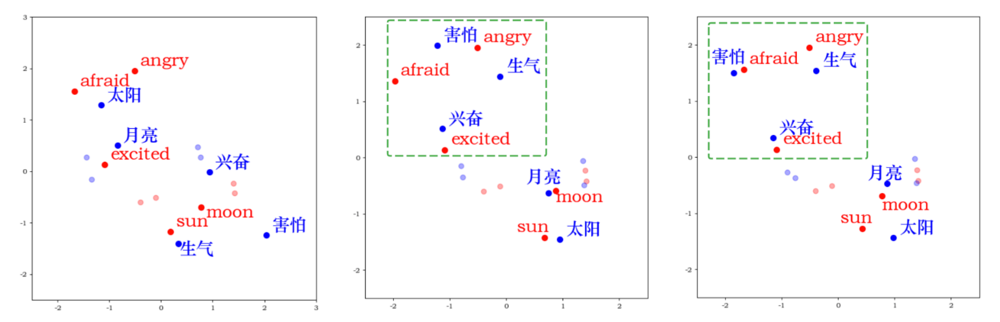

# MUSEDA
## MUSEDA (MUSE for Domain Adaption)
A frame for pivot mining and weighted embedding alignment base on MUSE Library

MUSE for classification in sentiment domain: both three pictures display word embeddings in English (red) and Chinese (blue) which projected down to two dimensions using PCA. Comparing with the left picture, the middle one show the original word embeddings projection in global alignment, while the right one show the weight alignment of the keyword pairs (pivots) in sentiment analysis (domain) like: <angry, 生气>, <afraid, 害怕> and <excited, 兴奋>.

## Usage
1. git pull or clone [MUSE](http://pytorch.org/) library
2. replace supervised.py/unsupervised.py/trainer.py/dico_builder.py/util.py with our files.
3. set up weighted dictionary (e.g. data/MSA/weight)
4. run

